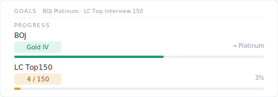

# Problem Solving

> BOJ Platinum · LeetCode Top Interview 150 — 하루 한 문제, 꾸준히.

---

<!-- CATEGORIES:START -->

### LeetCode Top Interview 150

| Category | Progress | Count | Done |
| --- | --- | --- | --- |
| Array / String | `░░░░░░░░░░` 4% | 1 / 24 |  |
| Two Pointers | `░░░░░░░░░░` 0% | 0 / 5 |  |
| Sliding Window | `░░░░░░░░░░` 0% | 0 / 4 |  |
| Matrix | `░░░░░░░░░░` 0% | 0 / 5 |  |
| Hashmap | `░░░░░░░░░░` 0% | 0 / 9 |  |
| Intervals | `░░░░░░░░░░` 0% | 0 / 4 |  |
| Stack | `░░░░░░░░░░` 0% | 0 / 5 |  |
| Linked List | `░░░░░░░░░░` 0% | 0 / 11 |  |
| Binary Tree General | `░░░░░░░░░░` 0% | 0 / 14 |  |
| Binary Tree BFS | `░░░░░░░░░░` 0% | 0 / 4 |  |
| Binary Search Tree | `░░░░░░░░░░` 0% | 0 / 3 |  |
| Graph General | `░░░░░░░░░░` 0% | 0 / 6 |  |
| Graph BFS | `░░░░░░░░░░` 0% | 0 / 3 |  |
| Trie | `░░░░░░░░░░` 0% | 0 / 3 |  |
| Backtracking | `░░░░░░░░░░` 0% | 0 / 7 |  |
| Divide & Conquer | `░░░░░░░░░░` 0% | 0 / 4 |  |
| Kadane's Algorithm | `░░░░░░░░░░` 0% | 0 / 2 |  |
| Binary Search | `░░░░░░░░░░` 0% | 0 / 7 |  |
| Heap | `░░░░░░░░░░` 0% | 0 / 4 |  |
| Bit Manipulation | `░░░░░░░░░░` 0% | 0 / 6 |  |
| Math | `░░░░░░░░░░` 0% | 0 / 6 |  |
| 1D DP | `░░░░░░░░░░` 0% | 0 / 5 |  |
| Multidimensional DP | `░░░░░░░░░░` 0% | 0 / 9 |  |
| **Total** | `░░░░░░░░░░` **1%** | **1 / 150** | |

<!-- CATEGORIES:END -->
